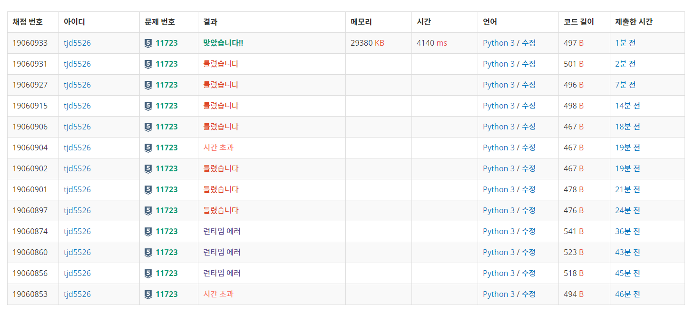

[집합](https://www.acmicpc.net/problem/11723)
```python
import sys
ans = [0]*21
alled = [1]*21
emptyd = [0]*21
for i in range(int(input())):
    a = sys.stdin.readline().rstrip()
    if a=='all':
        ans = alled
        continue
    if a=='empty':
        ans= emptyd
        continue
    pse, x = a.split()
    x=int(x)
    if pse=='add':
        ans[x]=1
    elif pse=='remove':
        ans[x]=0
    elif pse=='check':
        print(ans[x])
    elif pse=='toggle':
        if ans[x]==1:
            ans[x] = 0
        else:
            ans[x] = 1
```

파이썬이 싫어지는 문제